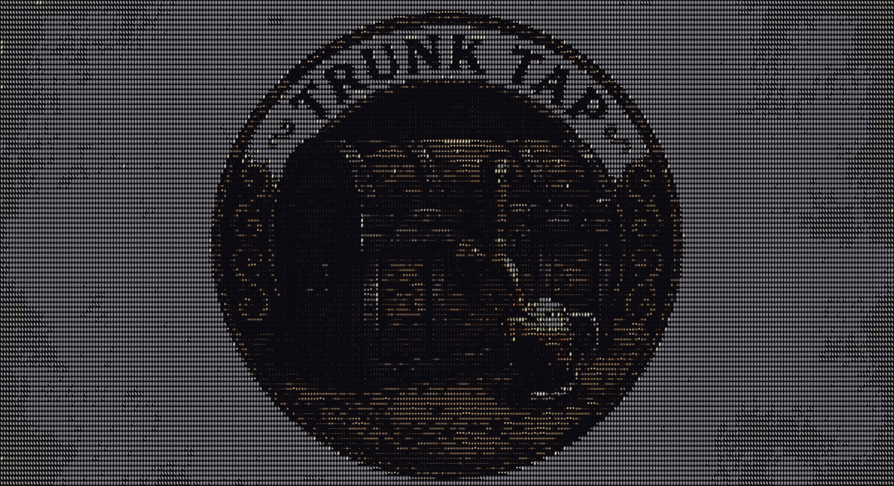

# Trunk Tap

<p align="center">
  
</p>

Local-first live dashboard for [SDRTrunk](https://github.com/DSheirer/sdrtrunk),
a software-defined-radio trunking scanner. Trunk Tap captures every trunking
event and every completed call in detail, transcribes every unencrypted call
with Whisper, and serves it all in a real-time web UI.

No cloud, no external services: everything lands in a local SQLite database
and is served from your machine.

## Features

- **Live call feed** — every completed call as it happens, with inline audio
  playback and Whisper transcripts streaming in over WebSocket
- **Control-channel event forensics** — registrations, affiliations,
  group/unit/data calls, denied grants, patches, roaming, adjacent-site
  broadcasts, parsed live from SDRTrunk's event logs
- **Talkgroup & radio directories** — per-network directories with aliases,
  call counts, air-time, encryption flags, first/last heard
- **Network topology graph** — interactive vis-network graph of everything
  connected in the last 24h (systems → sites → radios → talkgroups), edges
  weighted by activity, click any node to drill down
- **Stats** — calls/hour (stacked with encrypted) and a 24h talkgroup heatmap
- **Full-text search** — FTS5 index across every transcript and talkgroup name
- **Encrypted-call metadata analysis** — encrypted calls still yield RID,
  talkgroup, site, frequency, duration, and timestamp, so who-talked-to-whom,
  when, from which tower, for how long — all still answerable
- **Alerts** — anomaly detection for novel behavior: new radios, new
  talkgroups, new sites, roaming, activity spikes, encryption changes

## Architecture

Two live ingest paths, one store, one UI:

```
SDRTrunk ──RDIO Scanner POST──▶ /api/call-upload ─┐
   (audio + metadata per completed call)          │
                                                  ├─▶ SQLite (WAL) ─▶ Flask + Socket.IO ─▶ web UI
SDRTrunk event_logs/*.log ──watchdog tail─────────┘      ▲
   (control-channel events, parsed per row)              │
                                              whisper worker (background thread,
                                              transcribes pending calls)
```

- **`app.py`** — Flask + Flask-SocketIO app: RDIO Scanner ingest endpoint,
  REST/query API, WebSocket fanout
- **`ingest/rdio.py`** — RDIO Scanner protocol handler (audio save, DB insert,
  live broadcast)
- **`ingest/tail.py`** — real-time tail of SDRTrunk's `*_call_events.log` CSVs;
  handles log rotation, truncation, and dedup by SDRTrunk's event id
- **`ingest/aliases.py`** — imports talkgroup/radio aliases from SDRTrunk's
  playlist XML
- **`ingest/whisper_worker.py`** — background transcription worker; auto-picks
  the fastest available Whisper backend
- **`db/`** — SQLite layer (WAL mode, thread-local connections) and schema
- **`static/` + `templates/`** — single-page UI (vanilla JS, no build step)
- **`scripts/`** — ops helpers (start, wipe, playlist patching, tuner tuning)

### Storage

SQLite, WAL, indexed. Tables (see [db/schema.sql](db/schema.sql)):

- `systems`, `sites`, `talkgroups`, `radios` — with call counts, airtime,
  first/last seen
- `calls` — every RDIO Scanner call with `raw_json` for full forensics plus
  transcript columns
- `events` — every control-channel event with full details
- `affiliations`, `roaming`, `patches`, `denies`, `adjacent_sites` — derived
  analytical tables
- `anomalies` — novel-behavior alerts
- `calls_fts` — FTS5 index over transcripts + TG names

## Quickstart

```bash
git clone <repo-url>
cd trunk-tap
./install.sh
```

The installer checks for Python ≥ 3.10 (with per-platform install hints if
it's missing), creates `.venv/` and installs the dependencies, sets up a
Whisper transcription backend where it can, and bootstraps your local
`config/systems.json` and `config/coverage_targets.json` from the shipped
examples (both gitignored, so your presets stay private). It's idempotent —
safe to re-run. Flags: `--docker` skips the venv and verifies/prints the
Docker path instead, `--help` shows usage. Set `TRUNK_TAP_SKIP_WHISPER=1` to
skip the Whisper backend step.

Then start the dashboard:

```bash
./scripts/start.sh --fresh
```

and open http://127.0.0.1:5544. Next step:
[Point SDRTrunk at it](#point-sdrtrunk-at-it).

### Docker (zero-install alternative)

Everything — dashboard, SQLite, whisper.cpp transcription — runs in one
container. No SDR hardware or SDRTrunk needed on the Docker host: SDRTrunk
pushes calls in over HTTP.

```bash
./install.sh --docker        # verifies Docker and creates config files
docker compose up -d --build
```

(Or copy the `config/*.example.json` files by hand — that's all
`install.sh --docker` does beyond the Docker check.)

First boot downloads the Whisper model (`ggml-small.en.bin`) into
`data/models/`; override with `WHISPER_MODEL_NAME` (e.g. `ggml-base.en.bin`)
or a full `WHISPER_CPP_MODEL_URL`. UI at http://localhost:5544. All state
(DB, audio, model, exports) persists in `./data/`.

If SDRTrunk runs on the same machine, uncomment the read-only
`event_logs`/`playlist`/`configuration` mounts in `docker-compose.yml` to get
the live control-channel tail and alias import; without them only call
uploads flow in (the tailer just skips with a warning).

## Point SDRTrunk at it

In SDRTrunk: **Playlist Editor → Streaming**:

1. Add a new **RDIO Scanner** streaming target.
2. **Host**: `http://127.0.0.1:5544/api/call-upload` (or the Docker host's
   address if the dashboard runs in a container elsewhere).
3. **API Key**: leave blank, or set `SDRTD_RDIO_KEY=yourkey` before starting
   the dashboard and enter that same key here.
4. **System ID**: any integer per system (SDRTrunk requires it). The dashboard
   ignores it — it keys on `systemLabel` instead.
5. Under each **channel** in the playlist, in the **Streaming Configuration**
   tab, tick the RDIO target.
6. Save & restart the channel.

Audio decode needs the JMBE library configured in SDRTrunk User Preferences,
or calls arrive without audio.

`scripts/patch_playlist.py` can do the playlist edit for you (adds the RDIO
stream element and tags every alias with a broadcast channel; idempotent,
always writes a timestamped backup first).

The event-log tail is automatic — the dashboard watches
`~/SDRTrunk/event_logs/` (override with `--log-dir` or `SDRTRUNK_HOME`).

## Configuration

- **`config/systems.json`** (copy from `config/systems.example.json`,
  gitignored) — your network identities:
  - `canonical_rules` fold SDRTrunk's site-specific event-log names into one
    network identity (exact maps and prefixes, applied in order). Example:
    SDRTrunk's site-specific names `"County P25 East"` / `"County P25 West"`
    fold into the network name used by RDIO uploads (`"Countywide"`), so
    events, calls, logs, and transcripts share one identity per network.
  - `rr_sids` maps canonical system names to RadioReference system ids so the
    UI can deep-link to RR (`"Countywide": 1234`, `"State P25": 5678`).
- **`config/coverage_targets.json`** (optional, gitignored) — watchlist for
  the TUNERS tab's coverage panel (frequencies in MHz).
- **Environment variables**:
  - `SDRTD_DATA_DIR` — root for the DB and `audio_calls/` (default: project
    dir; `/data` in Docker)
  - `SDRTD_RDIO_KEY` — require this API key on `/api/call-upload`
  - `SDRTD_EXPORT_DIR` — export tree root (default
    `~/Desktop/trunk-tap-export`)
  - `SDRTD_SYSTEMS_CONFIG` — override path to `systems.json`
  - `SDRTRUNK_HOME` — SDRTrunk's home dir (default `~/SDRTrunk`)
  - `SDRTD_WHISPER_MODEL`, `WHISPER_CPP_BIN`, `WHISPER_CPP_MODEL`,
    `SDRTD_WHISPER_PY_MODEL`, `SDRTD_WHISPER_PROMPT` — see below
  - `SDRTRUNK_BIN` — path to the `sdr-trunk` launcher, used by the ops
    scripts (default `/Applications/sdr-trunk/bin/sdr-trunk`)
  - `TRUNK_TAP_SKIP_WHISPER` — set to `1` to make `install.sh` skip the
    Whisper backend setup/check step

### Supported SDRs

Anything SDRTrunk supports — RTL-SDR, Airspy, HackRF, SDRplay. The TUNERS tab
reads SDRTrunk's `configuration/tuner_configuration.json` generically and
marks a tuner **ACTIVE** when traffic was seen in its receive window recently.

## Whisper backends

The transcription worker auto-picks the fastest available backend:

1. **`mlx-whisper`** — Apple Silicon, GPU/ANE. Default model:
   `mlx-community/whisper-large-v3-turbo`. Override with
   `SDRTD_WHISPER_MODEL=mlx-community/whisper-small`.
2. **whisper.cpp** — set `WHISPER_CPP_BIN=/path/to/whisper-cli` and
   `WHISPER_CPP_MODEL=/path/to/ggml-model.bin` (the binary was named `main`
   before whisper.cpp v1.7). This is the backend the Docker image uses.
3. **`openai-whisper`** — CPU fallback. `pip install openai-whisper`; set
   `SDRTD_WHISPER_PY_MODEL=base` (or `small`, `medium`, ...).

If none are installed, calls sit in `transcribe_state='pending'` — install any
backend and they'll start moving. Transcripts stream to the UI live over
WebSocket as they finish.

## CLI flags

```
--host 127.0.0.1        bind address
--port 5544             http port
--log-dir PATH          SDRTrunk event_logs to tail (default ~/SDRTrunk/event_logs)
--no-tail               skip log tail (RDIO uploads only)
--no-whisper            skip transcription worker
--fresh                 wipe DB + audio_calls/ on startup
```

## Data locations

- **DB**: `db/sdrtrunk.db` (SQLite WAL); both DB and audio move with
  `SDRTD_DATA_DIR` (default: project dir; `/data` in Docker)
- **Audio**: `audio_calls/YYYY/MM/DD/<uuid>.mp3`
- **Export tree**: `~/Desktop/trunk-tap-export/` (override with
  `SDRTD_EXPORT_DIR`)
  - `logs/<System>.log` — every control-channel event, TSV, per system/site
  - `logs/<System>.calls.log` — every call: ts, TG, alias, RID, freq, enc,
    audio
  - `transcripts/<System>/<YYYY-MM-DD>/<HHMMSS>_TG.._RID..._callN.txt` —
    one file per transcribed call with a metadata header
- **Aliases** auto-imported on first boot from
  `~/SDRTrunk/playlist/default.xml` (`$SDRTRUNK_HOME/playlist/default.xml`)

If a DB already has split identities for one network, repair it with:

```bash
./.venv/bin/python scripts/merge-systems.py "Countywide" "County P25 East" "County P25 West"
```

## Scripts reference

| Script | Purpose |
|---|---|
| `install.sh` | One-command setup: Python check, venv + deps, Whisper backend, config bootstrap (`--docker` for the container path) |
| `scripts/start.sh` | Create `.venv` if needed, install deps, boot the dashboard |
| `scripts/wipe.sh` | Wipe dashboard DB + audio (`--all-logs` also nukes SDRTrunk event logs) |
| `scripts/patch_playlist.py` | Add an RDIO Scanner streaming target to SDRTrunk's playlist and tag every alias |
| `scripts/merge-systems.py` | Merge split system identities in the DB into one canonical system |
| `scripts/tune-hackrfs.py` | Auto-tune every HackRF in SDRTrunk's tuner config for 700/800 MHz P25 coverage |
| `scripts/sdrtrunk-launch.sh` | Kill stale SDRTrunk and relaunch with root + user home (needs the sudoers entry) |
| `scripts/install-sudoers.sh` | One-time sudoers entry for passwordless SDRTrunk launch/kill (validated with `visudo -c`) |
| `scripts/radio-autopilot.py` | Optional plug-and-play HackRF manager (see below) |

### Radio autopilot (plug-and-play HackRFs)

A LaunchAgent (run `scripts/radio-autopilot.py` every 60s) watches the USB
bus:

- **1 HackRF** — tuner pinned to 772 MHz (700 MHz block); 800 MHz channels
  auto-disabled so SDRTrunk stops logging "No Tuner Available".
- **2nd HackRF plugged in** — within ~2 min it is assigned 855 MHz, the
  800 MHz channels are re-enabled, and SDRTrunk restarts itself. Unplug it
  and the plan reverts the same way. Anti-flap: acts only on a stable radio
  count, max one restart per 5 min. Log: `logs/radio-autopilot.log`.

Requires the sudoers entry (`sudo bash scripts/install-sudoers.sh`, with
`SDRTRUNK_BIN` set if your launcher isn't at the default path). This is the
only part of the project that ever writes to SDRTrunk's config, and it always
makes a timestamped backup first.

### Fresh start

```bash
./scripts/wipe.sh              # wipe dashboard DB + audio
./scripts/wipe.sh --all-logs   # also nuke SDRTrunk event_logs/
./scripts/start.sh --fresh     # boot with a clean DB
```

## Gotchas learned the hard way

- SDRTrunk's RdioScannerBroadcaster only accepts the upload target when the
  test POST returns a body starting with `incomplete call data: no talkgroup`
  — anything else leaves it in ERROR and recordings queue forever in
  `~/SDRTrunk/streaming/`. This dashboard returns the right string; don't
  "fix" it.
- P25 Phase 1 decoder modulation choices in SDRTrunk are only C4FM/CQPSK;
  CQPSK **is** the simulcast setting (there is no LSM option for P25P1).

## Notes

- SDRTrunk logs frequency in MHz; the DB stores integer Hz.
- Site key is the RFSS-SITE string SDRTrunk emits (e.g. `1-1`).
- Encryption flag is inferred: for RDIO calls, zero-byte audio = encrypted;
  for event log rows, "ENCRYPT" or "SVC OPT ... ENC" in DETAILS = encrypted.

## Legal & responsible use

Receiving radio communications may be restricted in some jurisdictions, and
recordings may contain third-party communications and personal information.
Know your local laws before capturing, retaining, or sharing anything. Never
publish captured audio or transcripts containing personal information, and
keep your local `config/systems.json`, database, and `audio_calls/` out of
version control (the `.gitignore` already does this for you).

## License

MIT — see [LICENSE](LICENSE).
